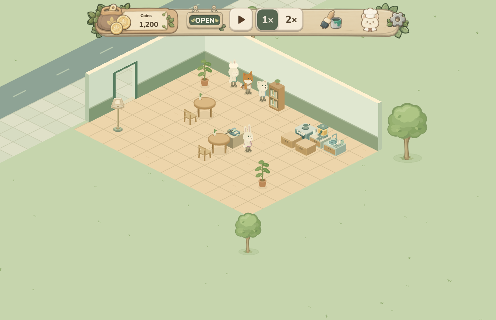
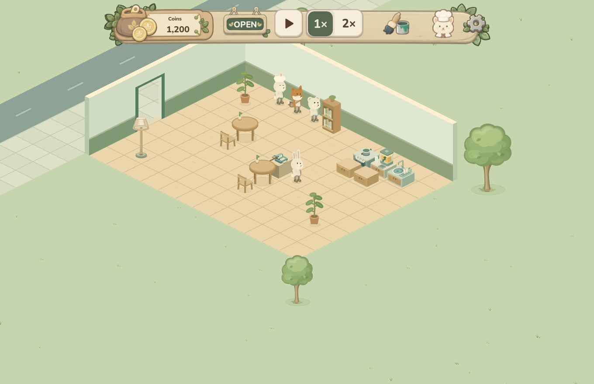
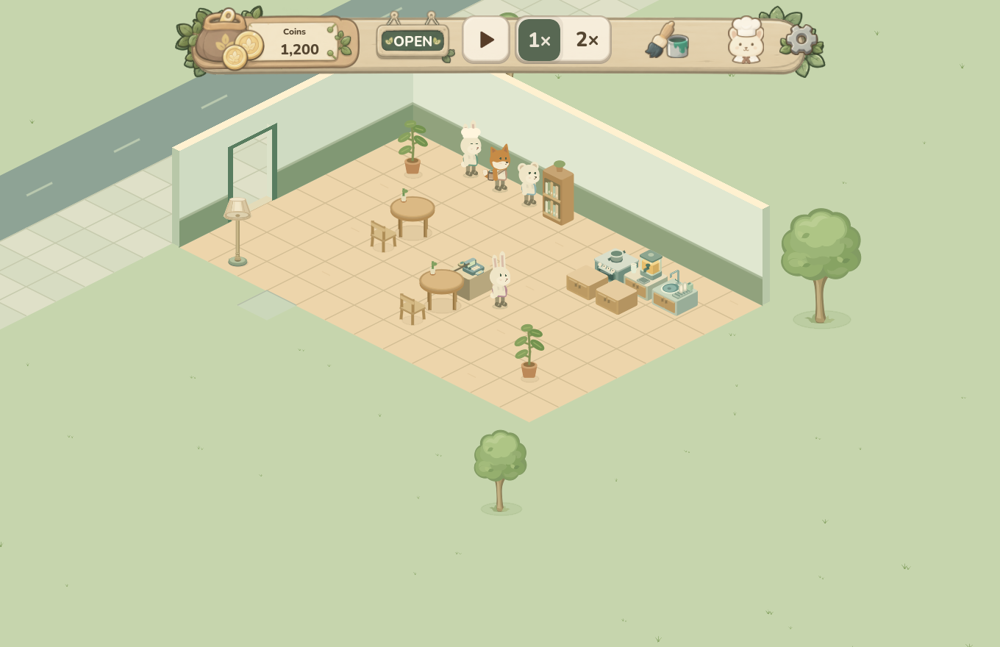

# Starter walls and legacy floor tiles

The starter plot is 12 by 9 tiles, but the old west shell and its collision
edge stopped at depth 8. Older saves also retained their independently saved
flooring and could lack the ninth starter row.

This change shares the current starter dimensions through `cafe_footprint.gd`.
The west shell reaches depth 9 for rendering and collision. On the first load
of an unmarked legacy save, only missing ninth-row starter tiles are filled;
existing floor styles, paid values, wallet, furniture and land ownership remain
unchanged. The saved geometry revision makes migration one-time.

An existing player-built wall on the former gap remains the authoritative wall,
including its hosted door or window. The default shell does not overlap it.
Historical eight-tile shell paid amounts remain exact, without refund inflation.
Malformed saves still fail without changing the source file or live model.

## Before and after

These previously captured images use the actual Godot Web engine with synthetic
fixtures, an identical fixed camera and frozen game time. They are evidence for
the geometry-only change, not a new capture of the combined branch.

| Fixture | Before | After |
| --- | --- | --- |
| New cafe |  |  |
| Synthetic legacy cafe |  |  |

The new cafe retains all 108 floor tiles and gains the missing wall segment.
The legacy fixture goes from 97 to 108 installed floor tiles, preserving its
existing green custom tile. Both comparisons keep the top HUD pixels unchanged.
See [VALIDATION.json](VALIDATION.json) for sanitized measurements and image hashes.

## Focused native checks

Use Godot 4.6.3 and Python 3:

```sh
# GODOT_BIN may point to an installed Godot executable.
python tests/run_starter_geometry_native.py
```

The runner imports a disposable copy and redirects native save/config/cache
paths. It runs the 119 geometry assertions and then the 10 startup-retry checks
against that same combined copy. The geometry suite covers fresh rendering,
collision and entrances; migration of versions 1, 5, 6, 11, 12, 13 and 15;
custom flooring, paid costs, ownership, walls and hosted openings; repeat loads;
and rejection without mutation. Only synthetic saves are used.

This change does not include unrelated HUD, introduction or other gameplay work.
Merging source does not deploy a game build.
