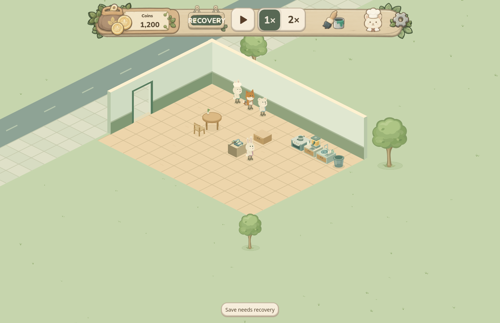
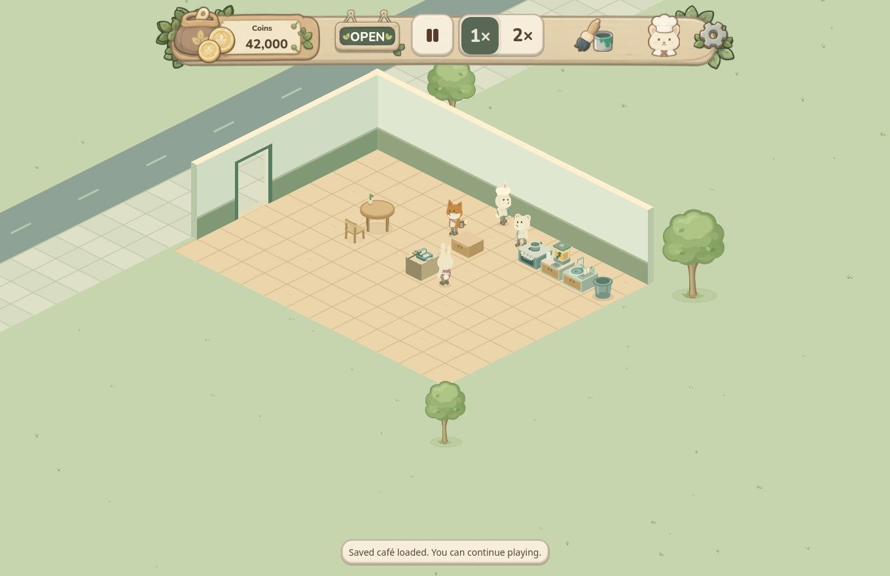

# Browser save startup retry

A transient browser-storage failure previously left the first client cached as failed. Even after storage recovered, the game stayed on its protected 1,200-coin placeholder and could not load the existing saved cafe.

The Help dialog now exposes the loading error and a keyboard-accessible **Try loading again** action. Retry opens a fresh storage client, retains authority identity and revision checks, and validates the full saved model in isolation before replacing the placeholder. It cannot discard edits after a later save conflict. Ambiguous legacy files, damaged authority and invalid layouts still fail closed; retry does not select, reset or repair them.

**The actual player's original startup failure remains unknown.** The demonstrated fix applies to transient loading failures. The captures and evidence below use synthetic data only; they do not establish the player's failure cause or recover their real progress. Merge and deployment require separate user approval.

## Captured before and after

The two browser contexts used identical synthetic native-v15 fixtures and the same once-only injected storage denial. Each context had separate disposable storage. In the candidate context, retry, operation, save and reload retained one authority profile.





[VALIDATION.json](VALIDATION.json) contains sanitized sequence results and capture hashes. Actual mouse input moved a table set, both save receipts were durable, and reload retained the exact saved payload at revision 3. Ambiguous, damaged and invalid-layout cases retained their stored bytes. No real player storage, private Library identifiers, host paths or credentials are published here.

## Reproduce focused checks

Use Godot 4.6.3, Python 3 and Node.js with Playwright installed in your test environment. Run only against disposable data.

```sh
# Set GODOT_BIN if Godot is not on PATH. This copies the project and
# redirects native save locations before importing or running it.
python tests/run_startup_retry_native.py

# PLAYWRIGHT_MODULE may specify an already installed Playwright module.
# CHROMIUM_PATH may specify an installed Chromium/Chrome executable.
node tests/startup_retry_browser.js

# Optional actual-engine regression against a candidate Web export:
node tests/startup_retry_browser.js --web-build /path/to/disposable/Web
```

The default browser test uses actual IndexedDB in fresh headless contexts. It checks the cached failed boot, fresh-client retry, byte preservation, identity/revision continuity, concurrent save ownership and corruption rejection. The native test checks model validation, transactional model replacement, write suppression and protection of already loaded edits. Its temporary project translates only the Web MEMFS staging path for native Windows compatibility.

The optional engine test seeds the same synthetic fixture, injects one boot failure, presses the focused retry action, moves a table set through real mouse input, waits for every durable receipt, and reloads the exact saved payload. It uses a local ephemeral server and closes its own browser contexts; no visible player window is controlled. Export only a disposable copy with the matching Godot Web template. Generated reports stay under ignored qa-project/.

The captured broader validation passed 276 native checks and 24 storage-boundary checks. These are local results; remote CI status is reported separately on the PR.
