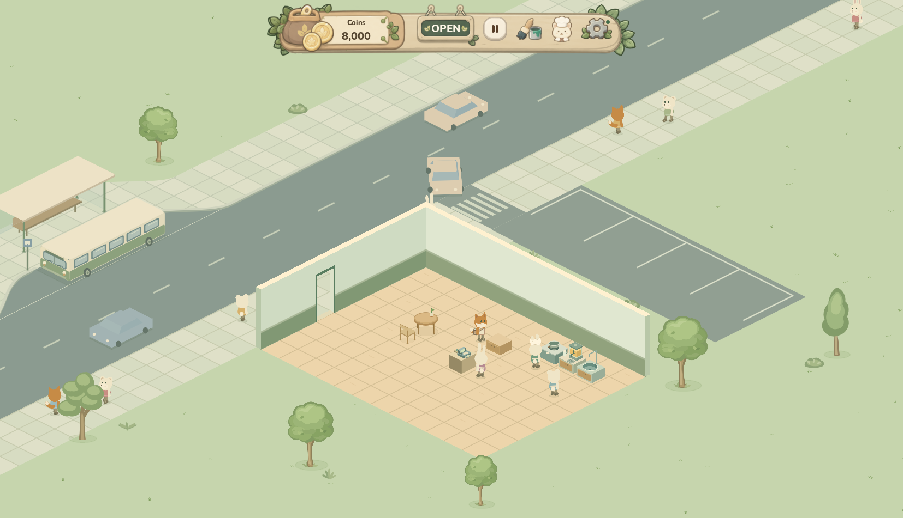
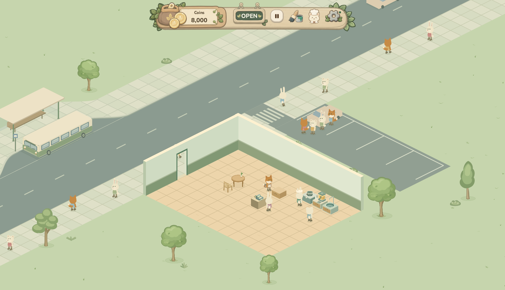
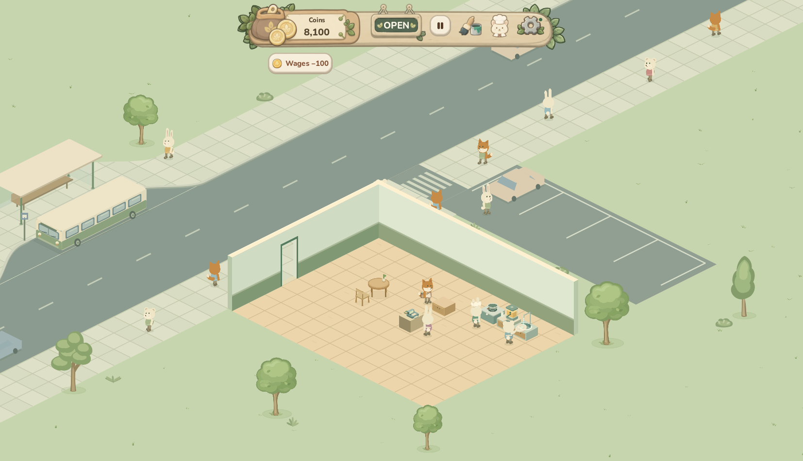
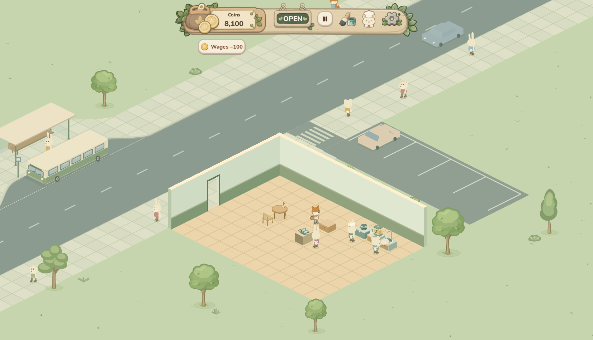
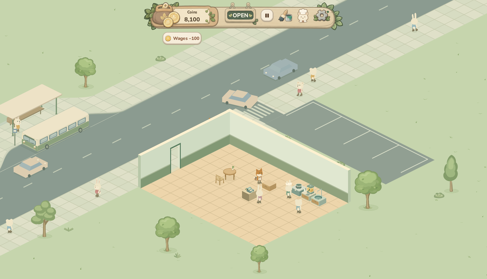

# Parking party candidate pixels

These are actual native Godot pixels from production drawing and Main service functions, with generated profiles and save writes suppressed. `receipt.json` binds production source hashes and each PNG; `capture.json` retains authoritative car/member states, guest/queue IDs, payment counters and clocks. The exact capture fixture is `tests/fixtures/parking_native_capture.gd` (launch in a staged project with a disposable APPDATA/LOCALAPPDATA, PARKING_CAPTURE_OUTPUT, and `--skip-intro`).

Six candidate checkpoints show the approach (27.5s), staggered disembark (32s), full-room queue (40s), partially returned party (150s), reverse out of the bay (156s), and road merge (159s). The car retains all four original members, holds for the last diner, and retires after the complete party exits. One real meal pays 200; the other three retain ordinary queue patience and return without payment. The original single-driver screenshot is an art reference from base a5dd, with a different synthetic funding/tutorial setup, not a matching pixel-delta experiment.

The fixture advances actual Main service/staff state manually and refreshes UI at capture points. It is not normal-speed continuous playback, an FPS qualification or independent visual acceptance. The candidate remains Draft; the For Sale sign purchase path also remains pending the editor boundary.

